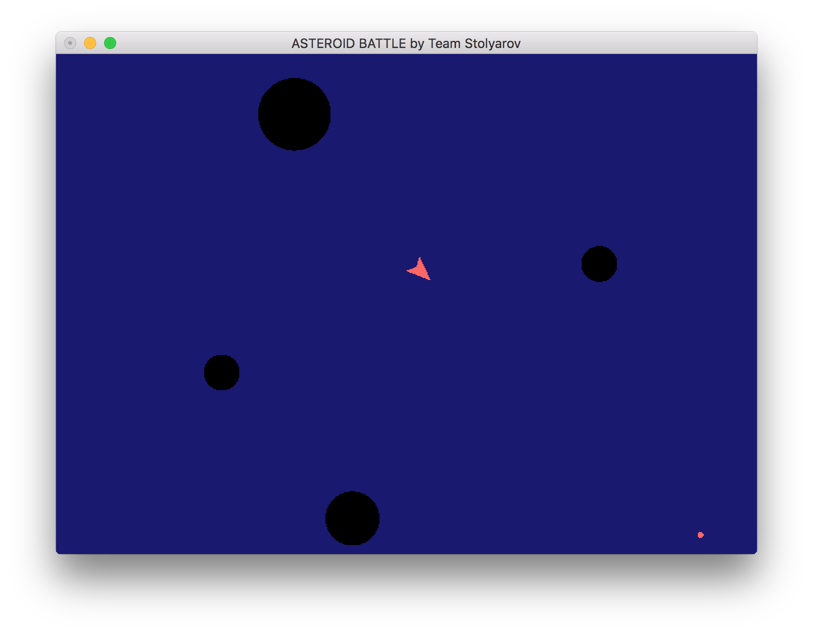
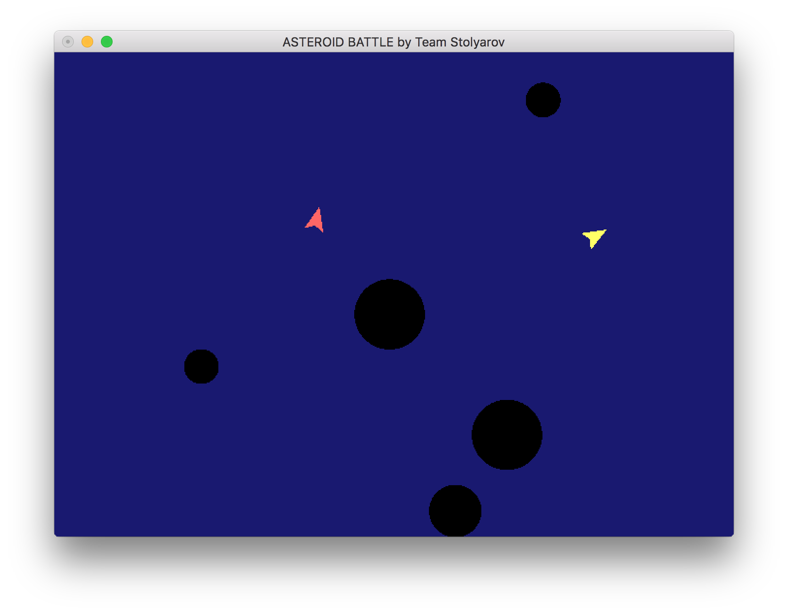

# asteroids

[](https://travis-ci.org/cmc-haskell-2016/asteroids)




## Building

Clone this repo and build the project with the Stack:<br />

```
git clone https://github.com/cmc-haskell-2016/asteroids.git<br />
cd asteroids<br />
stack setup<br />
```

The game consists of server and clients apps. The one should launch the server
and connect using the client.<br />
```
stack build && stack exec server "port" "game mode"<br />
stack build && stack exec client "ip" "port"<br />
```

You can use the scripts coming with the project as follows:<br />
```
./server.sh "port" "game mode"<br />
./client.sh "ip" "port"<br />
```

## Game

The game mode is either single or cooperative. Cooperative needs exactly 2
players. In single mode you need to surviving by shooting the asteroids. If you
bump into one you die. The same happens if you leave the playing area. You have
special shield that destroys asteroids when enabled.
In the cooperative you do pretty much the same but together with you friend.<br />
The death of one of the players leads to the Game Over for everyone.<br />
The server can process only one game session at once.<br />

## Controls

<b>Up</b> - accelerate<br />
<b>Left</b> - rotate left<br />
<b>Right</b> - rotate right<br />
<b>S</b> - enable shield<br />
<b>Space</b> - shoot<br />
<b>R</b> - restart game<br />
<b>Esc</b> - quit<br />
